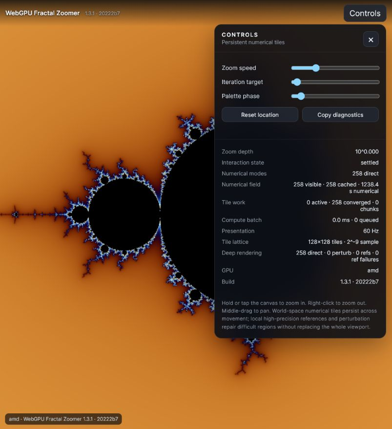
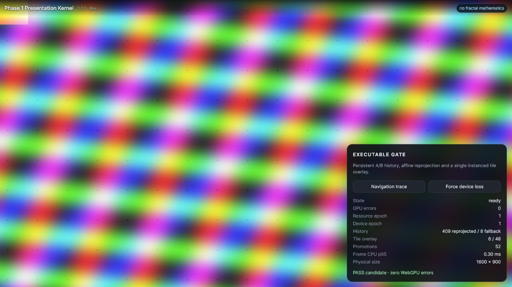

# Phase 1 gate evidence

Date: 2026-08-03  
Baseline commit: `20222b7370c48b187903054a699c2ce6a036aaf2`  
Browser GPU label: `amd`

## Automated build gates

- dependency install: `pnpm install --frozen-lockfile` passed;
- all 22 tagged WGSL modules parsed and passed reserved-token validation;
- 11 foundation, 30 v1.3, 14 persistent-field and all historical invariant checks passed;
- 12 Phase 1 presentation invariants passed;
- 15 independent f32 reprojection-oracle samples passed the 0.01 source-texel limit;
- strict TypeScript build passed;
- Vite production build passed.

## Real-browser WebGPU trace

The exact production `dist` artifact was served locally and exercised in the in-app Chromium WebGPU browser.

1. **Cold start:** `ready`, 1600×900 physical texture, resource epoch 1, zero WebGPU errors.
2. **History:** A/B history alternated and promoted repeatedly; accepted overlay tiles were emitted in one instanced draw.
3. **Navigation:** the four-second pan/zoom trace continued to present reprojected history with no clear frame and zero captured console/WebGPU errors.
4. **Resize:** 1600×900 landscape to 900×1200 portrait incremented the resource epoch from 1 to 2; output remained opaque and validation-clean.
5. **Zero size:** the explicit suspend hook entered `suspended` without acquiring/submitting, then returned to `ready` without a validation error.
6. **Device loss:** forced `device.destroy()` recovered from device epoch 1 to 2 on a fresh adapter/device, resumed at `ready`, and retained zero validation errors.
7. **Default route regression:** the unchanged Zoomer initialized on the same artifact, displayed the Mandelbrot set, converged 466 direct tiles, and reported 60 Hz with zero browser console errors.

Observed Phase 1 CPU encode/submit p95 was 0.30 ms at 1600×900 and 900×1200. This is host-side timing, not GPU timestamp timing; GPU timing remains a later instrumentation gate.

## Review disposition

- WebGPU lifecycle review required viewport history, synchronous canvas acquisition, transactional resize, bounded recovery and a persistent rAF. The isolated kernel implements those Phase 1 responsibilities.
- Numerical review prohibited fractal work and required pixel-centre transform oracles and a 0.01 source-texel packing limit. The kernel contains only deterministic presentation patterns and enforces that limit.
- Repository/testing review required a lockfile, Windows-safe WGSL paths, a distinct presentation route and deployment gated behind the tested build. Those changes are included.

## Remaining before production integration

- integrate the proven kernel beneath the numerical tile field in a separate PR;
- add offscreen byte readback against nearest and bilinear color oracles;
- add GPU timestamp queries on supported adapters;
- automate Chromium software-adapter smoke in CI without treating it as a substitute for the real-GPU gate;
- run the prescribed 15-second navigation corpus and 100-cycle resize stress test.
