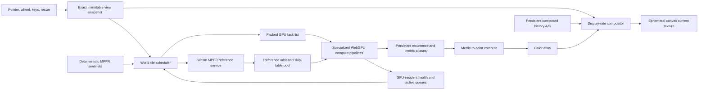

# WebGPU Fractal Zoomer

## Technical specification and development roadmap

**Research cut-off:** 3 August 2026  
**Target codebase:** [`byronbuzz/mandelbrot-zoomer`](https://github.com/byronbuzz/mandelbrot-zoomer), current `main` / version 1.3.1  
**Status:** architecture recommendation, implementation contract, and phased delivery plan

---

## 1. Executive decision

Do **not** restart the renderer again. The correct base is the current 1.3.1 persistent numerical tile field, with selected mathematical components retained from V4–V6.

The target system is:

> A persistent, exact-addressed numerical field in dyadic world space, refined asynchronously by bounded WebGPU compute; a display-rate compositor presents the best accepted tile samples over reprojected history; a Wasm arbitrary-precision service supplies local reference orbits; deep pixels use perturbation, rebasing, local repair, and later conservative skip approximations.

The order of construction matters more than any isolated optimization:

1. Prove a valid, continuously presentable WebGPU surface.
2. Add a correct shallow `f32` numerical field.
3. Add persistent recurrence and progressive scheduling without CPU–GPU lockstep.
4. Add exact coordinates and measured precision escalation.
5. Add Wasm arbitrary-precision references and a non-skipping perturbation baseline.
6. Add glitch recovery and deterministic validation.
7. Add GPU-resident compaction and asynchronous telemetry.
8. Add conservative BLA and then series approximation behind the full-step fallback.

This ordering incorporates the supplied deep-research report's governing rule: **avoid iterations before making iterations cheaper**. It also addresses the actual failure history of the repository: the hardest recurring defects were not Mandelbrot theory, but invalid WebGPU resource layouts, shader validation failures, unsafe presentation, false convergence, and synchronous readback.

### 1.1 Non-negotiable product outcomes

- Zoom and pan must never reveal an empty target merely because computation is pending.
- Presentation must remain independent of numerical completion.
- Stopping motion must continue refining existing numerical state, not restart a frame.
- Every displayed numerical sample must carry explicit quality and validity metadata.
- Iteration-cap hits are provisional, never silently equivalent to mathematical interior membership.
- Precision escalation is local and evidence-driven, not a single global zoom threshold.
- No ordinary frame may wait for `queue.onSubmittedWorkDone()`, `mapAsync()`, or a worker result.
- The direct-step, non-skipping perturbation path remains the GPU correctness baseline for every accelerator; MPFR remains the numerical oracle.
- A build is not releasable until a real browser test proves pipeline creation, command submission, visible first-frame output, progressive refinement, resize behavior, and zero uncaptured WebGPU errors.

---

## 2. Evidence and repository diagnosis

### 2.1 What should be retained

The connected repository already contains several strong foundations:

| Existing component | Decision | Reason |
|---|---|---|
| BigInt fixed-point camera and normalized binary scale | Retain | Prevents the camera itself losing position before GPU arithmetic begins. |
| Exact dyadic world-tile identities | Retain | Enables deterministic reuse across camera changes and clean spatial refinement. |
| 1.3.1 lazy coarse → intermediate → authoritative admission | Retain | Correctly separates spatial refinement from iteration refinement. |
| Monotonic accepted coverage | Retain | Repair and escalation must never create display holes. |
| V4 expansion arithmetic, reference candidate probing, and diagnostics | Extract and test | Numerically useful, but must be separated from the old frame lifecycle. |
| V5 display-cadence reprojection | Retain as a presentation principle | Gives XaoS-like continuity while new numerical work is pending. |
| Shared local perturbation references and tile-local repair | Retain conceptually | Initial references may serve a small 2×2 tile group; repair references are genuinely tile-local, so one bad reference cannot decide the viewport. |
| Separate result, recurrence, color, and quality state | Retain and strengthen | Palette changes must not rerun orbits; presentation validity must be explicit. |

The current architecture document is substantially correct. The stale root README should not be treated as authoritative.

### 2.2 What actually went wrong

The version history shows recurrent integration failures:

- An incompatible canvas/offscreen copy path and missing `COPY_DST` usage.
- Implicit-LOD texture sampling in divergent WGSL control flow.
- Host uniform allocations smaller than their WGSL layouts, including 48 versus 64 bytes and 16 versus 32 bytes.
- Invalid implicit unsigned-to-signed coordinate conversions.
- Use of WGSL reserved identifiers such as `smooth` and `meta`.
- Reference admission that rejected useful escaped or short local orbits, causing retry storms and zero perturbation work.
- Empty queue state being mistaken for numerical convergence.
- Simultaneous allocation of all spatial levels and non-monotonic reset paths that created black rectangles.

The current build contains source validators and architecture-string checks, but no browser/WebGPU first-frame integration test. That is why static validation could be green while actual pipeline creation, bind-group compatibility, command submission, presentation, or progress accounting failed.

One additional portability defect is present in `scripts/validate-wgsl-source.mjs`: it passes `URL.pathname` directly to Windows filesystem APIs, producing a path such as `C:\\C:\\...`. It should use Node's `fileURLToPath()`. This does not explain browser rendering failures, but it confirms that the validation layer itself needs executable cross-platform tests.

### 2.3 Current 1.3.1 bottlenecks

1. Every numerical batch awaits `device.queue.onSubmittedWorkDone()` and maps one counter buffer per tile. This serializes the producer and GPU.
2. Presentation performs a uniform write and draw for each visible retained tile.
3. Each tile owns many individual buffers, textures, bind groups, and uniforms; allocation and validation overhead scale with tile count.
4. The reference cache has no strict byte-budgeted LRU policy.
5. Worker reference requests are prioritized but not strongly cancellable by epoch or tile demand.
6. Requested reference working precision can exceed the actual triple-double/four-limb transport precision.
7. Glitch detection is heuristic and is not yet paired with a high-precision sentinel oracle.

These are reasons to refactor resource and scheduling internals, not reasons to discard the persistent-field architecture.

---

## 3. Governing architecture



### 3.1 Separate clocks

The application has three independent clocks:

- **Input/presentation clock:** `requestAnimationFrame`; integrates motion and presents every display opportunity.
- **GPU refinement clock:** bounded submissions; progresses tiles when queue capacity exists.
- **Reference/oracle clock:** Wasm workers; generates reference data and validates sparse samples without blocking either of the other clocks.

No clock waits synchronously for another. Results are adopted only if their identity and lease are still valid.

### 3.2 Separate truth domains

- The exact camera and world-tile keys are authoritative geometry.
- Numerical tile state is authoritative only within its recorded formula, precision, iteration, and error contract.
- Reprojected color is a temporary presentation fallback, never numerical evidence.
- A palette version changes color truth but not numerical truth.
- A view revision changes visibility and priority, but does not invalidate a mathematically identical world tile.

This last point is important: camera motion should obsolete scheduling priority, not automatically destroy useful numerical work.

---

## 4. Presentation and rendering specification

### 4.1 Why the canvas is presentation-only

The portable baseline must not treat the canvas texture as persistent compute storage. The WebGPU specification makes textures returned by `getCurrentTexture()` transient; reconfiguration and resize invalidate earlier textures. A custom canvas usage also replaces the default rather than adding to it, so `RENDER_ATTACHMENT` must be included explicitly if a custom usage is supplied. See the current [WebGPU specification](https://gpuweb.github.io/gpuweb/), [GPUCanvasContext reference](https://gpuweb.github.io/types/interfaces/GPUCanvasContext), and [GPUCanvasConfiguration reference](https://gpuweb.github.io/types/interfaces/GPUCanvasConfiguration.html).

The ordinary path is:

```text
persistent numerical state
    -> persistent metric/color atlas
    -> persistent offscreen composite/history
    -> fullscreen render pass
    -> freshly acquired canvas currentTexture
```

Direct compute-to-canvas can exist as a measured shallow fast path only when required usage and format features are available. It is not the architectural baseline.

### 4.2 Persistent presentation resources

| Resource | Suggested format/layout | Purpose |
|---|---|---|
| `historyA`, `historyB` | `rgba8unorm`; `TEXTURE_BINDING | RENDER_ATTACHMENT` plus copy usages only if used | Last accepted composed image plus immutable view, dimensions, formula epoch, color version, and anchor-quality metadata. Ping-pong only when accepting a new history anchor. |
| `tileColorAtlas` | `rgba8unorm`; `STORAGE_BINDING | TEXTURE_BINDING` | Color output for resident numerical tile slots. |
| metric/status planes | `r32float` smooth metric plus `r32uint` packed status/iteration, or compact SoA buffers | Avoids the 16-byte/pixel cost of an initial `rgba32float` atlas. Use `textureLoad`, not filtered metric sampling. |
| `tileDirectory` | storage buffer | Slot lease, world key, sample pitch, quality, formula epoch, precision mode, and atlas coordinates. |
| `visibleInstances` | storage/vertex buffer | One packed descriptor per visible tile for a single instanced draw. |
| palette/LUT | 1D texture or storage buffer | Recoloring without orbit work. |

The target should replace per-tile presentation textures and bind groups with atlas slots and stable bind groups. A 128×128 logical world tile is a reasonable starting point; compute can subdivide it into 8×8 or 16×8 workgroups and 32×32 scheduling blocks. Linear sampling from a color atlas requires duplicated one- or two-texel gutters plus contracted/clamped UVs and explicit LOD 0; otherwise adjacent slots bleed across tile boundaries.

### 4.3 Presentation pass

One instanced draw should render all visible tile quads. Each instance contains a camera-relative screen transform computed on the CPU from exact view snapshots, atlas UV bounds, slot lease, and quality flags. Deep absolute center subtraction must not occur in WGSL `f32`.

The compositor applies this order:

1. Clear to an opaque neutral color; configure the canvas with `alphaMode: 'opaque'` and retain default `RENDER_ATTACHMENT` usage unless an additional usage is genuinely required.
2. Sample the prior composed history through its history-to-current affine transform.
3. Overlay current world-tile samples only where the tile lease and accepted-quality flags are valid.
4. Build a non-overlapping visible coverage list, or render deterministically coarse-to-fine with an explicit replacement rule. Arbitrary overlapping instances are not allowed to decide which sample wins.
5. During motion, use explicit-LOD linear sampling for history and coarse tiles.
6. When settled at authoritative pitch, use nearest sampling for numerical samples unless a deliberate reconstruction filter is enabled.
7. Draw UI overlays separately.

A reprojected-only composition must never become the next history anchor. Accept a new anchor only after a defined minimum of newly accepted numerical coverage/quality; preserve the original exact source-view metadata until replacement. This prevents accumulated feedback blur. Palette/formula changes either rebuild history from compatible metrics or mark the old history explicitly temporary and stale.

The compositor must never sample a resource that is simultaneously written in the same pass. History ping-pong avoids read/write feedback.

### 4.4 XaoS continuity translated to WebGPU

XaoS achieves continuity by reusing the previous image, mapping old rows and columns to the new view, calculating only missing data, and returning `INCOMPLETE` when its time budget is exhausted. Its key implementation is [`src/engine/zoom.cpp`](https://github.com/xaos-project/XaoS/blob/7c0c40e31b337abf480d6901edcb30b673ed917a/src/engine/zoom.cpp), with the UI continuing refinement while incomplete. The [Developer's Guide](https://github.com/xaos-project/XaoS/wiki/Developer%27s-Guide#algorithms) explains the principle.

Do not port the serial row/column dynamic program literally. Preserve its invariants:

- show retained information immediately;
- keep exact coordinates separate from approximated pixels;
- calculate missing/high-value regions first;
- fill the display completely even when the numerical target is incomplete;
- continue larger refinement quanta after motion stops;
- stop consuming resources when the view is complete and idle.

The GPU analogue is affine history reprojection plus prioritized 2D tile refinement. Reprojection reproduces XaoS's perceptual continuity, not its computational row/column reuse; exact numerical reuse here comes from immutable world-tile identities and cached accepted samples.

### 4.5 Frame loop

For each `requestAnimationFrame(timestamp)`:

1. Integrate input using the supplied timestamp.
2. Apply a pending resize only if physical dimensions changed.
3. Create a new immutable view snapshot if the camera changed.
4. Recompute visible world-tile priorities without clearing reusable tile state.
5. If total outstanding submissions are below the configured cap, select a bounded task quantum.
6. Write one contiguous task packet or use a dynamic-offset ring. Never overwrite one uniform region for several dispatches that execute later.
7. Encode logically adjacent compute, color, and presentation work in one command buffer where useful.
8. Acquire `getCurrentTexture()` only inside a synchronous encode-and-submit segment; no `await`, worker callback, pipeline creation, or event-loop yield may occur before submission.
9. Submit once.
10. Present even if no compute was submitted.
11. Continue rAF while motion, refinement, palette animation, or telemetry requires it; stop when truly idle and restart on events.

The cap covers compute and presentation submissions because WebGPU exposes one ordered queue; a presentation submit cannot overtake long compute. When at the cap, submit nothing and retain the previous canvas image. Attach one non-awaited `onSubmittedWorkDone()` watermark when capacity closes, then reopen capacity when it resolves. Production compute quanta must fit the presentation budget: no queueing design can make a later camera reprojection overtake a 100 ms compute pass. The API definition of [`GPUQueue.onSubmittedWorkDone()`](https://gpuweb.github.io/types/interfaces/GPUQueue.html) confirms that it waits for all work submitted up to the call.

### 4.6 Resize and device loss

Resize rules:

- derive backing dimensions from CSS size and DPR;
- detect DPR/backing-size changes with `ResizeObserver` pixel-box data when available and a lightweight per-rAF size check or media-query fallback; window resize alone is insufficient;
- clamp to `maxTextureDimension2D` and the product's numerical pixel budget;
- suspend allocation and presentation at zero size;
- mutate `canvas.width/height` only when they change;
- create the new size-dependent set as a new resource epoch while retaining old history until the first valid new-size presentation is submitted; retire old resources only after a completion watermark;
- rebuild dependent views and bind groups;
- never retain a pre-resize canvas texture or view.

Device-loss rules:

- register `device.lost` immediately;
- register `uncapturederror` in production as well as development—fail tests immediately, but report and recover/degrade in production;
- stop new submissions and increment `deviceEpoch` on loss;
- request a fresh adapter/device, recreate every device-owned object, and reconfigure the canvas;
- reupload palette, resident reference data, and reconstructible state;
- ignore results carrying an old device epoch;
- fall back to WebGL2 or Wasm if reinitialization fails.

### 4.7 Presentation performance targets

Initial targets, subject to device profiling:

- display presentation: 60 Hz on mainstream desktop, 30 Hz minimum degraded target;
- presentation pass p95: under 2 ms at 1920×1080 on target desktop hardware;
- input-to-visible-reprojection p95: under 50 ms;
- no blank canvas during a deliberately blocked 100 ms queue, plus a separate production-sized bounded-quantum test meeting the reprojection latency target;
- queue depth: at most two ordinary submissions;
- no ordinary per-frame mapping or queue-wide wait;
- one instanced presentation draw for all visible tiles per atlas page/format class, not one draw per tile.

---

## 5. Exact camera and world lattice

### 5.1 Canonical view state

```ts
interface ExactView {
  centerX: { raw: bigint; fractionalBits: number };
  centerY: { raw: bigint; fractionalBits: number };
  scale: { mantissa: number; exponent2: number };
  formulaEpoch: number;
  viewRevision: number;
}
```

User-entered decimal locations are parsed without an intermediate JavaScript `number`. Convert them to the canonical dyadic representation at a working precision exceeding the display pixel requirement.

### 5.2 World-tile identity

A tile key is independent of the camera:

```ts
interface WorldTileKey {
  sampleExponent2: number; // sample pitch = 2^sampleExponent2
  tileX: bigint;
  tileY: bigint;
  formulaEpoch: number;
}
```

The integer tile coordinates locate a fixed dyadic square. Parent and child relations are exact. This provides:

- stable caching during continuous zoom;
- deterministic coarse/fine overlap;
- cross-level reference reuse;
- lossless URL/bookmark state;
- reproducible tests and exports.

### 5.3 Coordinate construction

For each tile, compute the reference-relative tile origin and pixel step on the CPU or in Wasm. Transfer high/low or mantissa/exponent components. Never calculate `deepCenter + pixel * tinyScale` in WGSL `f32`.

Adjacent-coordinate distinguishability is an explicit admission test. If two exact adjacent samples split to the same representation, that representation is not permitted for the tile.

---

## 6. Numerical pipeline

### 6.1 Baseline quadratic recurrence

For Mandelbrot:

\[
z_0=0,\qquad z_{n+1}=z_n^2+c.
\]

The direct kernel must perform, in this order:

1. Main-cardioid and period-two-bulb tests for quadratic Mandelbrot only. Accept the shortcut only beyond a representation-specific rounding margin; ambiguous boundary cases continue through the orbit kernel or a higher tier.
2. Squared-magnitude escape test; no square root.
3. Early escape.
4. Optional delayed/adaptive periodicity checks.
5. Smooth value calculation once, after escape.
6. Explicit provisional status at maximum iteration count.

Distance estimation, Julia formulas, orbit traps, and periodicity are separate compiled pipeline variants. Do not create one maximal shader with runtime flags for every feature.

### 6.2 Precision ladder

| Tier | Coordinate representation | Orbit representation | Use | Exit/escalation evidence |
|---|---|---|---|---|
| P0 | camera-relative `f32` | direct `f32` | Whole set and shallow views | Adjacent sample collapse, non-finite state, or oracle mismatch. |
| P1 | `f32×2` high/low | direct `f32` or measured `f32×2` direct variant | Moderate depth and reference-pending fallback | Coordinate error or direct-orbit error exceeds budget; throughput crossover favors perturbation. |
| P2 | exact reference-relative offsets with bounded conversion error | Full-step perturbation; multi-limb reference samples and double-single deltas by default | Normal deep zoom | Propagated bound failure, delta range failure, or reference exhaustion. Plain `f32` delta is only an optional sentinel-guarded fast path. |
| P3 | same | Extended-range double-single delta mantissa plus signed binary exponent | Very deep / exponent-limited views | Bound failure, normalization information loss, ineffective rebasing, or oracle disagreement. |
| P4 | arbitrary precision | MPFR/Wasm direct or higher-tier perturbation | Sparse verification and pathological tiles | Final oracle tier. |

WGSL currently exposes concrete `f32`, optional `f16`, and 32-bit integers, but no concrete `f64` or 64-bit integer type. See the current [WGSL specification](https://gpuweb.github.io/gpuweb/wgsl/). Portable “double precision WebGPU” therefore means an expansion, limbs, explicit exponent, or—preferably for this workload—a high-precision reference plus perturbation.

`f16` is permitted for palette/postprocessing experiments, not membership arithmetic.

### 6.3 High-precision reference service

Replace the current triple-double worker ceiling with a narrow Wasm arbitrary-precision service. MPFR/GMP is preferred where bundle size is acceptable; a rigorously tested arbitrary-precision alternative is acceptable.

Requirements:

- dedicated worker pool, initially one or two workers;
- entire orbit loop executed inside Wasm—no per-iteration JS/Wasm boundary;
- request precision based on pixel pitch plus guard bits, then raised by measured orbit error;
- default initial rule: `ceil(-log2(pixelSpacing)) + 64` bits, explicitly treated as a guard heuristic rather than proof;
- transferable bulk orbit buffers;
- request identity containing formula epoch, tile/reference key, precision, target length, and cancellation token;
- byte-budgeted CPU and GPU LRU caches;
- short, escaped, and finite reference segments are admissible local data;
- stale results may enter a cache only if their mathematical key remains valid and the cache budget allows it; they must not mutate an unrelated slot.

Reference storage must preserve near-zero orbit values. Plain `f32` reference samples are insufficient. Transport precision has its own measured ladder: two-, three-, or four-limb mantissas per component, selected from a required per-sample error bound. Four limbs from the current implementation remain supported until reconstruction tests prove that a smaller tier is adequate. Compare MPFR orbits at increasing precision or use directed bounds before accepting a reference. A practical GPU structure-of-arrays layout is:

- `array<vec4f>`: real high/low and imaginary high/low mantissas;
- exponent metadata that preserves both complex components—normally separate real/imaginary exponents, or a proven shared scale with an explicit bound showing the smaller component remains representable;
- a separate packed flags/reference-segment plane;
- optional `array<f32>`: conservative log2 error bound.

The exact packing is a measured choice, but normalization failure, NaN, or infinity must set an explicit invalid flag—never silently become zero.

### 6.4 Full-step perturbation baseline

Let `Z_n` be the high-precision orbit for reference parameter `C`, and let a pixel be `C + c` with orbit `Z_n + z_n`. Then:

\[
z_{n+1}=2Z_nz_n+z_n^2+c.
\]

The recurrence is algebraically exact, but its GPU evaluation is rounded because reference samples, deltas, and operations are finite precision. Implement it before any skip approximation and preserve it as the non-skipping GPU baseline. MPFR direct evaluation—not the GPU path—is the oracle.

After each exact step and each accepted approximation step, apply rebasing when:

\[
|Z_m+z_n|<|z_n|.
\]

Operationally, after forming the current total orbit `w_n = Z_m + z_n`, if `|w_n| < |z_n|`, set `z_n <- w_n`, set reference index `m <- 0`, preserve global iteration `n`, and do not advance the recurrence twice. The new delta relative to `Z_0 = 0` is the current orbit value. The mathematical and practical background is well summarized in Claude Heiland-Allen's [Deep Zoom](https://mathr.co.uk/web/deep-zoom.html).

### 6.5 Glitch and error policy

Use several independent signals:

- coordinate distinguishability;
- propagated or conservative delta error;
- Pauldelbrot-style glitch heuristic, e.g. `|Z+z|² < G|Z|²`, with `G` configurable and never treated as proof;
- reference exhaustion;
- non-finite or normalization failure;
- approximation remainder failure;
- deterministic sentinel disagreement.

Track coordinate-packet error `e_c`, reference-sample error `e_Z`, delta error `e_z`, and operation rounding `rho`. A conservative recurrence has the form:

\[
e'_z \le 2(|Z|+|z|)e_z + 2|z|e_Z + 2e_Ze_z + e_z^2 + e_c + \rho.
\]

Certify escape only when the lower bound on `|Z+z|` exceeds the bailout radius. If its uncertainty interval intersects the boundary, the pixel remains uncertain and is recomputed. Coordinate error must also remain below a configured fraction of sample pitch; mere adjacent-value inequality is necessary but insufficient.

Recovery is tile-local:

1. Mark uncertain pixels without erasing older accepted color/quality.
2. Choose a failed pixel coordinate from the region, then generate its candidate reference directly in MPFR; do not trust the glitched approximate orbit itself.
3. Reset only unresolved recurrence state.
4. Recompute the affected subset or child tile.
5. If the reference budget is exhausted, validate or directly compute sparse pixels in Wasm.
6. Surface unresolved status in diagnostics; never classify it as converged.

For quadratic Mandelbrot, rebasing and multiple references are strong. Do not generalize single-reference assumptions to folded formulas, hybrids, or formulas with multiple critical points.

### 6.6 Scaled perturbation

Represent a small delta as `z = S w`, where `S` is a power-of-two scale. Then:

\[
w_{n+1}=2Z_nw_n+Sw_n^2+d,\qquad c=Sd.
\]

Power-of-two scaling avoids an additional rounding step while the scale remains exponent metadata. If the scale changes, transform both `w` and `d`; materializing subnormal `f32` values can still lose information. A small `Z_n` is not itself failure, but all nonlinear and injection terms must be evaluated with exponent-aware bounds. This path is added only after full-step perturbation and recovery pass the deep corpus, and falls back when cancellation or term alignment exceeds the certified error.

### 6.7 Series approximation

The initial perturbation segment may be skipped with:

\[
z_n=A_nc+B_nc^2+C_nc^3+\cdots.
\]

For coefficients `a_(k,n)`, freeze and test the recurrences `a_(1,n+1)=2 Z_n a_(1,n)+1` and `a_(k,n+1)=2 Z_n a_(k,n)+sum_(j=1)^(k-1) a_(j,n)a_(k-j)` for `k>1`.

Start with low order—normally two or three—evaluated by Horner's method. Build coefficients per reference and accept a skip only if a certified tail/interval bound, including coefficient-generation and evaluation rounding, is below the numerical budget. A last-coefficient or coefficient-ratio heuristic is insufficient unless analytically justified. Record table-build cost, evaluated pixels, accepted skip length, and net time saved.

Series approximation is a production candidate only after full-step perturbation, repair, conservative linear BLA, and sentinels are stable.

### 6.8 Bilinear approximation (BLA)

For a valid block:

\[
z_{n+l}=A_{n,l}z_n+B_{n,l}c.
\]

Compose transforms hierarchically:

\[
A=A_yA_x,\qquad B=A_yB_x+B_y.
\]

Requirements:

- conservative validity radii covering the internal trajectory, coefficient/reference quantization, and rounding—not only endpoints;
- radii include the maximum parameter delta for the owning tile;
- table indices remain aligned after rebasing;
- rejected blocks fall to smaller blocks and finally one exact step;
- derivative propagation is mathematically consistent if distance estimation is enabled;
- a skip may not hide an internal rebase/glitch event: certify absence or split blocks at guarded reference minima;
- BLA off/on renders are differentially tested against full-step perturbation;
- feature is automatically demoted if accepted skips do not repay lookup/table costs.

BLA is high-value and cutting edge, but its benefit is scene-dependent. It remains an experimental production feature until the benchmark corpus demonstrates a correctness/performance Pareto improvement. See [FractalShark](https://github.com/mattsaccount364/FractalShark), [Fractalshades](https://github.com/GBillotey/Fractalshades), [Imagina](https://github.com/5E-324/Imagina), and the mathr.co.uk deep-zoom notes for reference approaches.

If distance estimation is enabled, freeze `q_0=0`, `q_(n+1)=2 w_n q_n+1`, the bailout/index convention, and the chosen distance formula. Perturbation, BLA, and series variants propagate the same derivative map and its error; a nonlinear skip may not reuse only the linear `A,B` derivative update.

---

## 7. GPU resource and kernel architecture

### 7.1 Atlas and slot model

Replace per-tile device objects with a bounded slot pool.

```ts
interface TileRecord {
  key: WorldTileKey;
  slot: number;
  slotLease: number;
  precisionMode: number;
  targetIterations: number;
  completedIterations: number;
  acceptedPixels: number;
  activePixels: number;
  uncertainPixels: number;
  referenceId: number;
  qualityFlags: number;
  lastUsedFrame: number;
}
```

The lease increments whenever a slot is reassigned. Every GPU task and presentation instance carries the lease; stale work cannot publish into a reused slot.

Recommended bounded profiles:

- desktop default numerical/color atlas budget: approximately 256 MiB;
- conservative/mobile profile: approximately 96 MiB;
- reference GPU cache: 32–64 MiB initially;
- CPU/Wasm reference cache: 64–128 MiB initially.

WebGPU does not expose a reliable total-memory figure. Select from adapter limits, allocation success, device class measurements, and product policy—not a guessed percentage of VRAM.

Large state pools must be paged so that every individual binding stays within `maxStorageBufferBindingSize`, and every atlas dimension stays within `maxTextureDimension2D`. A logical slot ID therefore resolves to `(page, localSlot)`; it must not assume one monolithic buffer.

### 7.2 State layout

Keep ordinary persistent state near 16–32 bytes per active pixel. Use structures of arrays where kernels consume the same field across neighboring lanes.

Possible direct-state layout:

- `zRe`, `zIm`: two `f32` buffers;
- `iterationAndStatus`: packed `u32`;
- optional high/low components in a separate P1 pool rather than burdening P0;
- accepted metric/color stored separately.

Possible perturbation-state layout:

- delta mantissa real/imaginary;
- signed exponent or scale index where required;
- reference index and iteration;
- packed status/rebase count.

Do not allocate derivative or orbit-trap fields in the baseline pool. Those variants have their own pools or explicit additional planes.

### 7.3 Task packets and dispatch

Use one storage task list per submission. A task includes at least:

```wgsl
struct TileTask {
  slot: u32,
  slotLease: u32,
  resourceEpoch: u32,
  policyVersion: u32,
  formulaEpoch: u32,
  precisionMode: u32,
  iterationStart: u32,
  chunkIterations: u32,
  maxIterations: u32,
  referenceId: u32,
  referenceLease: u32,
  flags: u32,
  blockX: u32,
  blockY: u32,
}
```

Generate exact WGSL member alignment, member size, array stride, total struct size, and binding `minBindingSize` from one schema or verify all of them through reflection. “A multiple of 16 bytes” alone is not sufficient, especially for `vec3`, arrays, and nested structures. Uniform rings using dynamic offsets must observe the adapter's alignment. Bulk task data is usually better in a storage buffer, and each buffer region remains immutable for its submission.

Dispatch options:

- X/Y cover the tile's workgroups and Z selects a task; or
- a flattened workgroup index resolves a task/block from the task buffer.

Cap every axis by `maxComputeWorkgroupsPerDimension`; bounds-check task index and pixel coordinates in WGSL. The shader compares task slot/reference leases and resource/policy epochs against GPU directories before any write or publish. Presentation performs the same slot-lease check.

Use separate dispatches/pipelines for direct, perturbation, series/BLA-enabled, derivative, and trap variants. Group tasks by pipeline before encoding.

### 7.4 Workgroup and chunk tuning

Initial candidates:

- workgroups: 8×8, 16×8, 8×16, 16×16;
- iteration chunks: 32, 64, 128, 256;
- unroll factors: 1, 2, 4, 8.

No one choice is universal. Select a safe baseline and benchmark variants per measured device profile. Very large kernels risk register pressure, compilation cost, watchdog resets, and worse input latency.

Workgroup memory is used only for shared reference/table segments, reductions, histograms, or compaction. Independent pixels do not benefit enough to justify barriers. Any collective must have uniform participation.

### 7.5 GPU-resident continuation

The initial refactor may use CPU-selected tile tasks without waiting for results. The production target adds:

1. per-workgroup active counts;
2. tile reduction pass;
3. active block/tile append queue;
4. indirect dispatch argument generation;
5. `dispatchWorkgroupsIndirect` for continuation;
6. asynchronous sparse telemetry every N frames or on diagnostic request.

Compaction is enabled only below a measured active-fraction crossover. Whole-grid chunking can be faster while most pixels remain active.

### 7.6 Submission state and publication

CPU state is explicitly `queued -> encoded -> submitted -> completed/failed -> published`. Encoding or submission never advances `completedIterations`, accepted coverage, or convergence. GPU-written completion records carry task ID, slot lease, reference lease, resource/policy epoch, and resulting frontier; they are consumed asynchronously. Invalid command buffers or failed submissions therefore produce no numerical progress. Release tests deliberately invalidate a bind group and prove that frontiers and convergence remain unchanged.

### 7.7 One ordinary submission

A normal submission may contain:

1. initialize/reset selected unresolved blocks;
2. direct compute passes;
3. perturbation compute passes;
4. active/health reduction and optional compaction;
5. metric-to-color pass for changed slots;
6. optional offscreen history-anchor update;
7. presentation pass to the canvas.

Submission should not be followed by a queue-wide wait. Timestamp and diagnostic buffers use a small rotating readback pool and are mapped later.

---

## 8. Scheduler and progressive quality

### 8.1 Independent refinement axes

Each tile advances independently along:

- spatial pitch;
- iteration depth;
- precision tier;
- reference/repair quality;
- color version;
- antialiasing/export quality.

The scheduler must never encode all of these into one “quality level.”

### 8.2 Priority function

A useful starting model is:

```text
priority value =
  visible_uncovered_area
  × expected_view_lifetime
  × focus_weight
  × estimated_quality_gain
  × reuse_probability
  / estimated_gpu_cost
```

Schedule center/pointer-adjacent tiles early during direct manipulation, but retain deterministic Morton order for benchmarks and export. Avoid a top-to-bottom scan.

### 8.3 Progressive tiers

1. **H0: history:** immediate reprojected accepted image.
2. **S0: coarse coverage:** one numerical sample per roughly 4–8 display pixels (pitch 4×–8× authoritative pitch).
3. **S1: intermediate coverage:** pitch approximately 2× authoritative pitch.
4. **S2: authoritative spatial coverage:** sample pitch no larger than one display pixel.
5. **I: iteration continuation:** same tiles progress toward user target.
6. **P: precision/repair:** uncertain tiles escalate or gain local references.
7. **Q: settled quality:** distance estimation, adaptive supersampling, or export refinement.

Finer levels are admitted lazily after the current level drains sufficiently. New view requests may supersede admission, but they do not erase reusable world tiles.

### 8.4 Interaction states

`moving`, `settling`, and `settled` modify latency budget and priority, not mathematical truth.

- Moving: short compute budget, coarse/high-reuse tasks first.
- Settling: moderate budget, authoritative spatial coverage promoted.
- Settled: larger bounded quanta, iteration/precision completion and verification.

Start with a 4–8 ms compute target at 60 Hz and adapt from GPU timestamps and outstanding queue depth. On slower devices, reduce resolution and task count before allowing queue latency to grow.

### 8.5 Epochs and cancellation

Use distinct identities:

- `deviceEpoch`: device recreation;
- `resourceEpoch`: atlas/size-dependent resource recreation;
- `formulaEpoch`: formula, bailout, membership-affecting settings;
- `precisionPolicyVersion`: interpretation of accepted numerical state;
- `viewRevision`: camera visibility and priority;
- `colorVersion`: palette/shading only;
- `slotLease`: physical atlas ownership.

Submitted GPU work cannot be cancelled. Keep it short, stop encoding obsolete priority work, and reject stale slot leases. Worker requests use cooperative cancellation and periodic checks inside long orbit generation.

---

## 9. Color, antialiasing, and optional observables

Numerical outputs and color outputs remain separate.

Baseline accepted metrics:

- escaped/interior/provisional/uncertain status;
- escape iteration;
- smooth iteration value;
- numerical precision/error tier;
- optional derivative/distance value.

Palette changes update `colorVersion` and recolor accepted metrics only.

Quality features are staged:

1. smooth coloring;
2. histogram/palette mapping;
3. distance-estimation variant;
4. adaptive supersampling guided by distance or local variation;
5. orbit-trap variants;
6. high-resolution export.

Do not use four equal corner colors as a safe tile-uniformity proof. Thin filaments can cross a tile without touching corners. Region filling requires conservative distance/error bounds or must be explicitly labeled approximate.

---

## 10. Fallbacks and deployment

Select capabilities, not browser names.

### WebGPU primary

- compute iteration and compaction;
- storage buffers/textures;
- indirect continuation when profitable;
- timestamp queries when supported;
- async pipeline creation;
- device-loss recovery.

### WebGL2 fallback

- one-pass fragment renderer for shallow/moderate views;
- optional ping-pong floating render targets for bounded continuation;
- `KHR_parallel_shader_compile`, `EXT_disjoint_timer_query_webgl2`, and `EXT_color_buffer_float` queried, never assumed;
- same exact camera serialization and product UI;
- clearly reported precision ceiling.

### Wasm fallback/oracle

- `f64`/SIMD shallow renderer when GPU APIs are unavailable;
- arbitrary-precision references and sparse direct validation;
- high-resolution correctness export if GPU validation fails.

Shared Wasm memory and Wasm workers are optional deployment profiles because cross-origin isolation changes hosting and embedding constraints. See current [Emscripten SIMD](https://emscripten.org/docs/porting/simd.html) and [Wasm Workers](https://emscripten.org/docs/api_reference/wasm_workers.html) documentation.

---

## 11. Validation and benchmarking

### 11.1 Release-blocking browser tests

Static parsing is necessary but insufficient. CI must run a browser against an actual WebGPU implementation and fail on:

- shader compilation messages of severity error;
- rejected async pipeline creation;
- non-null validation or out-of-memory error scopes during setup;
- any `uncapturederror`;
- invalid command submission;
- blank/transparent first frame;
- no progress after a valid task submission;
- false convergence when unresolved pixels remain.

Required presentation scenarios:

1. Deterministic checkerboard compute into persistent offscreen texture and fullscreen presentation.
2. A/B history alternation.
3. Valid-tile overlay over reprojected history.
4. Continuous resize, DPR changes, and zero-size transition.
5. A blocked 100 ms queue that preserves the previous canvas without blanking, plus a separate bounded-quantum test that meets current-view reprojection latency.
6. Stale worker result and stale slot-lease rejection.
7. Intentional `device.destroy()` and complete recovery.
8. Uniform-layout fixtures containing scalar, `vec2`, `vec3`, arrays, and nested structures.
9. Exact parent/child tile-edge coverage with no cracks, double-dark seams, overlap ambiguity, or accepted-sample regression during admission/eviction.
10. Historical regressions: invalid first-load clear uniform yields zero convergence; the `10^5.52`/`10^13.84` reference retry storm cannot recur; the `10^6` premature-perturbation/rectangular-hole trace remains monotonic; divergent sampling, 48/64-byte uniform, and unsigned/signed texture-coordinate cases fail in CI.

Run a software adapter for deterministic smoke coverage and real AMD, Nvidia, Intel, and Apple adapters in scheduled/device-lab tests. Do not claim cross-vendor bit identity; compare classifications and bounded numerical values.

### 11.2 Numerical oracle corpus

Include:

- whole-set view;
- cardioid and period-two bulb interiors;
- exterior-heavy views;
- boundary/seahorse views;
- camera scale/pixel spacing approximately `10^-12`, `10^-30`, `10^-100`, `10^-300`, and below `10^-1000` where supported (magnifications `10^12`, `10^30`, `10^100`, `10^300`, and `10^1000`);
- high-period minibrot nuclei;
- near-parabolic locations;
- reference returns close to zero;
- maximum-iteration-cap cases;
- reference exhaustion and secondary-reference cases;
- folded/deep-needle cases if nonanalytic formulas are added.

Differential tests:

- stabilized/directed MPFR direct vs full-step perturbation;
- rebasing off/on;
- primary vs secondary reference;
- `f32` vs `f32×2`;
- ordinary vs scaled perturbation;
- BLA/series off/on;
- reused vs newly generated reference;
- CPU/Wasm vs GPU reference path if a GPU fixed-point path is added.

Also test invariance across valid reference choices, rebase histories, tile subdivision, scheduling chunk sizes, and tile boundaries; extreme real/imaginary exponent disparity; normalization/subnormal/flush-to-zero/signed-zero boundaries; rescaling around near-zero reference returns; BLA inputs just inside/outside radii and spanning reference minima; series acceptance boundaries; and randomized MPFR differential cases. MPFR golden values must themselves stabilize as precision increases or use directed intervals; genuinely unresolved boundary cases are recorded as unresolved, not forced into a golden classification.

Compare at least:

```text
escaped/status, escape iteration, smooth value,
distance estimate, uncertainty/glitch flags, rebase count
```

### 11.3 Performance corpus and metrics

Record raw JSON with commit, browser, OS, adapter limits/features, backing size, DPR, scene, precision tier, and settings.

Metrics:

- input-to-present latency;
- presentation, compute, color, and reference time p50/p95/p99;
- dispatch and submission counts;
- outstanding queue depth;
- active fraction by pass;
- explicit iterations executed;
- analytic, series, and BLA iterations skipped;
- BLA/series table construction time;
- reference generation/upload time;
- state bytes per active pixel;
- cache bytes and evictions;
- stale/cancelled tasks;
- uncertainty, sentinel mismatch, and local-repair rates;
- device-loss/watchdog/timeouts;
- sustained mobile performance and thermal decline.

Pixels per second alone is not an acceptable benchmark because it hides differing iteration work, precision, antialiasing, and correctness.

---

## 12. Code organization and migration

Recommended target modules:

```text
src/
  exact/             camera, dyadic coordinates, serialization
  gpu/
    device/          adapter, device epochs, error scopes, recovery
    layouts/         generated host/WGSL shared layouts
    resources/       atlas pools, slot leases, buffer rings, LRU budgets
    pipelines/       direct, perturbation, reduction, color, present
  field/             world tile keys, directory, quality contracts
  scheduler/         priorities, interaction budgets, task packing
  presentation/      history A/B, instance list, compositor
  reference/         worker protocol, Wasm service, orbit/table caches
  precision/         tier policy, error bounds, sentinels, repair
  benchmark/         scenes, traces, metrics, raw JSON writer
  app/               input, UI, diagnostics, lifecycle
```

Migration rules:

- Keep the current app operational while the new presentation/resource core is built behind a feature flag.
- Extract mathematical primitives into tests before moving them.
- Do not import V4/V5/V6 coordinator or frame-lifecycle classes.
- Replace per-tile resources incrementally with atlas slots.
- Preserve URL/camera compatibility.
- Delete legacy production paths only after benchmark and browser gates establish parity.
- Correct the README once the milestone naming is stable.

---

## 13. Development roadmap

Effort estimates assume one experienced graphics/numerical engineer and are less important than the exit gates. Do not advance a phase because time elapsed.

### Phase 0 — Freeze conventions and repair validation

**Goal:** make correctness definitions and executable checks authoritative.

Deliverables:

- Freeze pixel-center convention, aspect mapping, bailout comparison, escape index, smooth formula, and provisional-interior semantics.
- Fix Windows validator paths with `fileURLToPath()`.
- Generate or reflect host/WGSL layouts from one schema.
- Add shader compilation info, validation scopes, uncaptured-error capture, and named object labels.
- Add browser automation with a software WebGPU adapter plus a real-device job.
- Store the deterministic scene corpus and navigation traces.

Exit gate:

- Cross-platform static checks run.
- A browser test can deliberately introduce and detect a bad layout, bad shader, invalid bind group, and blank first frame.

### Phase 1 — Presentation kernel

**Goal:** prove continuous valid output without Mandelbrot complexity.

Deliverables:

- Persistent offscreen checkerboard compute target.
- Fullscreen presentation to a freshly acquired canvas texture.
- History A/B and camera-relative reprojection.
- Generation-valid tile overlay.
- Resize/DPR/zero-size lifecycle.
- One/two-submission queue-depth gate.
- Device-loss recreation.

Exit gate:

- First frame visible on all target browsers/devices.
- Zero validation errors through repeated resize and forced loss.
- No blank/stale takeover during rapid input and simulated long compute.

### Phase 2 — Batched shallow numerical field

**Goal:** add correct `f32` Mandelbrot without compromising Phase 1.

Deliverables:

- Atlas slot pool and lease generation.
- Packed tile tasks and stable bind groups.
- Direct specialized compute shader with analytic interior tests and early escape.
- Metric-to-color pass and palette-only recoloring.
- Single instanced presentation draw.
- Lazy coarse/intermediate/authoritative spatial admission.

Exit gate:

- Whole-set and boundary scenes match the CPU/Wasm oracle within defined tolerances.
- Presentation remains independent of completion.
- No per-tile device object creation in the hot path.

### Phase 3 — Persistent recurrence and asynchronous scheduling

**Goal:** remove frame replacement and CPU–GPU lockstep.

Deliverables:

- Per-pixel resumable recurrence state.
- Fixed bounded iteration chunks.
- GPU tile health reduction.
- Delayed rotating readback only for telemetry.
- Adaptive task quantum from timestamps/queue depth.
- Byte-budgeted numerical/color LRU.

Exit gate:

- No per-batch wait/map remains. Non-awaited completion watermarks enforce queue capacity and consume delayed completion records.
- Stopping motion continues existing recurrence.
- Iteration-cap pixels remain provisional and progress later.

### Phase 4 — Coordinate and moderate-precision tiers

**Goal:** make precision selection explicit before deep perturbation.

Deliverables:

- Exact reference-relative tile coordinate packets.
- Tested `TwoSum`, `TwoProd`, renormalization, scaling, and complex expansion primitives.
- P0/P1 pipeline variants.
- Adjacent-coordinate distinguishability and numeric-health escalation.
- Sparse deterministic sentinels.

Exit gate:

- Tier changes are local and hysteretic.
- No global zoom crossover.
- The moderate-depth corpus agrees with the oracle.

### Phase 5 — Arbitrary-precision reference service

**Goal:** remove the present ~96-bit effective reference ceiling.

Deliverables:

- Wasm MPFR/equivalent worker service.
- Bulk reference generation and transfer.
- Extended-range GPU orbit representation.
- Byte-budgeted multi-level reference cache.
- cooperative cancellation and demand-based precision.
- instrumentation of orbit generation and upload.
- cache keys containing exact reference coordinate, formula/parameters, initial condition or critical point, precision/rounding mode, representation/error-contract version, orbit length, and indexing convention;
- hard CPU/GPU byte ceilings, bounded stale-worker CPU time, lease-safe in-flight eviction, and measurable eviction behavior.

Exit gate:

- Reference samples, including near-zero returns, reconstruct within their error contracts.
- Stale worker results cannot mutate current resources.
- Deep camera state never passes through JS `number` absolute coordinates.

### Phase 6 — Full-step perturbation and local recovery

**Goal:** establish the deep correctness baseline.

Deliverables:

- Algebraically complete, non-skipping quadratic perturbation kernel with propagated rounding/reference error.
- rebasing after every exact/accepted skip step;
- explicit non-finite, glitch, reference-exhausted, and uncertainty flags;
- secondary-reference selection and tile-local reset;
- sentinel-driven escalation;
- diagnostic visualization of uncertain pixels and reference regions.

Exit gate:

- `10^-30`, `10^-100`, and `10^-300` corpus matches MPFR classification contracts.
- Weak references damage only their local tiles.
- Repair never erases older accepted presentation.

### Phase 7 — GPU-resident active work

**Goal:** remove long-tail wasted work and host intervention.

Deliverables:

- active block/tile queue;
- compaction/scan or atomic append;
- indirect continuation;
- measured crossover policy;
- asynchronous timestamp/health readback pool;
- reference and atlas eviction telemetry.

Exit gate:

- Compaction wins end-to-end on heterogeneous/high-iteration scenes and is disabled where it loses.
- Queue depth and input latency remain bounded.

### Phase 8 — Scaled perturbation and conservative linear BLA

**Goal:** extend exponent range and add the general later-orbit skip mechanism.

Deliverables:

- mantissa/exponent delta representation;
- guarded rescaling;
- conservative hierarchical linear transforms and outward-rounded radii;
- guarded reference-minimum splits and rebase-aligned lookup;
- full-step fallback and differential toggles.

Exit gate:

- Zero unexplained sentinel regressions.
- Table construction plus evaluation yields a net corpus win; automatic demotion occurs where it loses.

### Phase 9 — Series approximation

**Goal:** add the specialized initial-segment accelerator after the general skip baseline is proven.

Deliverables:

- low-order coefficient recurrences and Horner evaluation;
- certified tail/interval bound including coefficient/evaluation rounding;
- full-step fallback at the acceptance boundary;
- accepted/rejected skip and build-cost telemetry;
- derivative-consistent variant if distance estimation is enabled.

Exit gate:

- Equal-error comparison shows a clear performance Pareto gain on specified deep scenes with no unexplained sentinel regression.

### Phase 10 — Quality, portability, and production hardening

Deliverables:

- WebGL2 and Wasm fallbacks;
- adaptive supersampling/distance-estimation variants;
- high-resolution export;
- sustained mobile/thermal profiles;
- device-profile autotuning;
- cache-pressure and device-loss soak tests;
- accessibility and exact shareable state.

Exit gate:

- Published support matrix is capability-derived.
- All release gates and reproducible benchmarks pass.

---

## 14. GitHub reference survey

The repositories below are the most directly useful implementations found in the current survey. They are references, not drop-in dependencies. Many are copyleft; study techniques and independently implement unless the product deliberately accepts the relevant license.

| Repository | Directly useful code/technique | Recommended use | License/caveat |
|---|---|---|---|
| [`byronbuzz/mandelbrot-zoomer`](https://github.com/byronbuzz/mandelbrot-zoomer) | Current persistent field; V4 reference math; V5 reprojection; 1.3.1 lazy admission and monotonic coverage. Key current file: [`progressiveTileFieldRenderer.ts`](https://github.com/byronbuzz/mandelbrot-zoomer/blob/main/src/presentation/progressiveTileFieldRenderer.ts). | Base code and failure evidence. Refactor; do not restart. | Project-owned. |
| [`xaos-project/XaoS`](https://github.com/xaos-project/XaoS) | Previous-image reuse, row/column relocation, interruptible progressive refinement, exact coordinate metadata. [`zoom.cpp`](https://github.com/xaos-project/XaoS/blob/master/src/engine/zoom.cpp), [`algorithms.md`](https://github.com/xaos-project/XaoS/blob/master/src/engine/algorithms.md). | Presentation/scheduler principles, not deep arithmetic. | GPL-2.0 family; CPU algorithm should not be copied into a non-GPL product. |
| [`webgpu/webgpu-samples`](https://github.com/webgpu/webgpu-samples) | Canonical compute/render, image blur ping-pong, resize, Game of Life A/B state, boids/timestamps. | WebGPU lifecycle and testing reference. | Verify file/repository license. |
| [`Desarso/mandelbrot-webgpu`](https://github.com/Desarso/mandelbrot-webgpu) | WebGPU fixed-point reference orbit, HDR perturbation, rebasing, skip hierarchy, separated compute/shading. [`perturbation.wgsl`](https://github.com/Desarso/mandelbrot-webgpu/blob/main/src/render/perturbation.wgsl), [`bla.ts`](https://github.com/Desarso/mandelbrot-webgpu/blob/main/src/render/bla.ts). | Closest WebGPU deep-zoom comparison. Audit normalization and derivative semantics before borrowing ideas. | GPL-3.0-or-later; self-reported performance. |
| [`edobrb/mandelbrot`](https://github.com/edobrb/mandelbrot) | Recent WebGPU perturbation renderer, compute-buffer → fullscreen render, bounded in-flight work. | Host/render-loop comparison and current browser implementation reference. | Verify current license before reuse. |
| [`gcollombet/mandelbrot`](https://github.com/gcollombet/mandelbrot) | Rust/Wasm arbitrary precision, float-exp perturbation, BLA, progressive texture state, extensive experiment/proof notes. | Architecture and research comparison. | Root license unclear in survey; do not copy until resolved. |
| [`LegalizeAdulthood/kalles-fraktaler`](https://github.com/LegalizeAdulthood/kalles-fraktaler) | Mature perturbation, scaled perturbation, series approximation, float-exp, multi-reference recovery. Key generated formula sources under `formula/`. | Numerical behavior and edge-case reference. | AGPL-3.0-or-later; desktop/OpenCL architecture. |
| [`mattsaccount364/FractalShark`](https://github.com/mattsaccount364/FractalShark) | CUDA-oriented HDR/double-single arithmetic, perturbation, BLA, reference compression, tests. [`Perturb.cuh`](https://github.com/mattsaccount364/FractalShark/blob/main/FractalSharkGpuLib/Perturb.cuh), [`LAKernel.cuh`](https://github.com/mattsaccount364/FractalShark/blob/main/FractalSharkGpuLib/LAKernel.cuh). | GPU data layouts and BLA test ideas. | GPL-3.0; README documents broken/experimental kernels. |
| [`GBillotey/Fractalshades`](https://github.com/GBillotey/Fractalshades) | Clear arbitrary-precision reference, derivatives, perturbation, extended-range arithmetic, chained BLA. [`perturbation.py`](https://github.com/GBillotey/Fractalshades/blob/master/src/fractalshades/perturbation.py), [`xrange.py`](https://github.com/GBillotey/Fractalshades/blob/master/src/fractalshades/numpy_utils/xrange.py). | Oracle and readable mathematical reference. | MIT; Python/Numba, not a GPU blueprint. |
| [`5E-324/Imagina`](https://github.com/5E-324/Imagina) | Linear approximation, rebasing, float-exp, reference compression, recovery waypoints. | Algorithm comparison and compression ideas. | AGPL-3.0; Windows/SIMD oriented. |
| [`rust-fractal/rust-fractal-core`](https://github.com/rust-fractal/rust-fractal-core) | Perturbation, glitch detection, automatic reference movement, series approximation, probe-based skip selection. | Control-flow and recovery reference. | GPL-3.0; large CPU/Rust codebase. |
| [`bertbaron/mandelbrot`](https://github.com/bertbaron/mandelbrot) | Compact browser WebGPU perturbation and extended floating representation. | Small comparative implementation. | GPL-3.0. |
| [`JMaio/deep-fractal`](https://github.com/JMaio/deep-fractal) | Browser/WebGL perturbation and adaptive supersampling. | WebGL fallback and browser deep-zoom history. | GPL-3.0. |
| [`LeandroSQ/js-mandelbrot`](https://github.com/LeandroSQ/js-mandelbrot) | Side-by-side WebGPU, WebGL, Wasm, Canvas, and JS implementations. | Backend harness ideas, not a scientific benchmark. | MIT. |

No surveyed repository provides a vendor-neutral, common-scene browser benchmark covering equal precision, equal quality, GPU completion, and error rate. This project should publish that harness as part of its own contribution.

---

## 15. Risk register

| Risk | Severity | Control |
|---|---:|---|
| Another greenfield rewrite discards known-good exact camera and tile work | Critical | Explicit migration contract; feature-flagged internal replacement. |
| Static checks pass while WebGPU runtime is invalid | Critical | Real browser first-frame and validation-error release gate. |
| CPU/GPU lockstep destroys throughput and input latency | Critical | No ordinary waits/maps; queue-depth gate and delayed readback pool. |
| Deep reference precision is advertised beyond transported precision | Critical | MPFR service, explicit sample error contracts, sentinels. |
| Invalid approximation silently corrupts images | Critical | Full-step perturbation fallback, conservative bounds, uncertainty flags, differential toggles. |
| Stale GPU/worker work writes into reused storage | Critical | Slot leases and distinct epochs on every task/result. |
| Presentation holes during repair/escalation | High | Monotonic accepted-quality plane; history fallback. |
| Per-tile resource and draw overhead scales badly | High | Atlas slots, stable bind groups, packed tasks, one instanced draw. |
| Reference cache exhausts memory during long zoom | High | Byte-budgeted LRU and cancellation. |
| GPU compaction costs more than it saves | Medium | Measured active-fraction crossover and automatic disable. |
| BLA/series table cost or register pressure outweighs skips | Medium | End-to-end metrics and exact baseline comparison. |
| Copyleft code is copied into an incompatible product | High | Treat GPL/AGPL sources as research; independent implementation or deliberate license choice. |
| Mobile thermal collapse | Medium | Sustained tests, dynamic render scale, bounded budgets. |

---

## 16. Immediate implementation backlog

The next ten engineering items should be:

1. Add `fileURLToPath()` to the Windows-broken validator and make validation run on Windows and Linux.
2. Add a browser/WebGPU smoke test that captures compilation info, error scopes, uncaptured errors, and a non-black first-frame assertion.
3. Build the checkerboard offscreen → fullscreen canvas presentation harness.
4. Add history A/B reprojection and a valid-tile mask while simulating slow tile jobs.
5. Implement slot leases and a small color atlas, then render all tiles with one instanced draw.
6. Port only the shallow direct `f32` Mandelbrot path into packed tile tasks.
7. Add in-flight task ownership, GPU completion/health records, and queue-cap watermarks; only then remove per-batch waits and per-tile mapping.
8. Introduce generated/reflected host/WGSL layouts and delete handwritten packing for new structures.
9. Add the MPFR/Wasm reference-service spike with one bulk orbit and reconstruction tests.
10. Establish the full-step perturbation differential test before adding any BLA or series code.

The first visible milestone is not “deeper zoom.” It is a renderer that cannot go blank, cannot accept stale work, cannot call invalid WebGPU objects “converged,” and remains responsive while computation is deliberately delayed. Once that invariant is real, the advanced mathematics can be layered without returning to the previous debugging loop.

---

## 17. Primary standards and technical sources

- [WebGPU specification](https://gpuweb.github.io/gpuweb/)
- [WGSL specification](https://gpuweb.github.io/gpuweb/wgsl/)
- [GPUCanvasContext API reference](https://gpuweb.github.io/types/interfaces/GPUCanvasContext)
- [GPUQueue API reference](https://gpuweb.github.io/types/interfaces/GPUQueue.html)
- [WebGPU samples](https://github.com/webgpu/webgpu-samples)
- [XaoS Developer's Guide](https://github.com/xaos-project/XaoS/wiki/Developer%27s-Guide)
- [Deep Zoom — Claude Heiland-Allen](https://mathr.co.uk/web/deep-zoom.html)
- [Kalles Fraktaler manual](https://mathr.co.uk/kf/manual.html)
- [Emscripten WebAssembly SIMD](https://emscripten.org/docs/porting/simd.html)
- [Emscripten Wasm Workers](https://emscripten.org/docs/api_reference/wasm_workers.html)